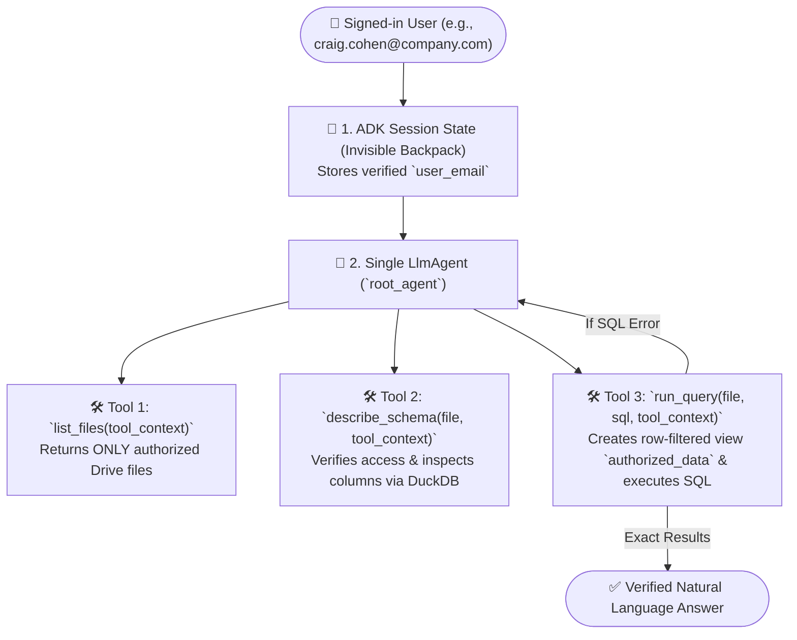

# 🎓 Learning Google ADK (`learning-google-adk`)

> **Hands-On Learning Repository**: A comprehensive study guide, architectural playbook, and project lab for mastering **Google's Agent Development Kit (ADK)** from first principles to production-grade enterprise agents.

This repository documents the core concepts, 5-step architectural mental models, authentication workflows, and hands-on implementations (starting with an **Identity-Aware Natural Language Data Agent** modeled after **Gemini Enterprise** & Google Drive access controls).

---

## 📚 Complete Learning Curriculum (`docs/`)

All lessons, mental models, and architectural notes from building this project are documented step-by-step inside the **[`docs/`](./docs/)** folder:

1. **[📘 Lesson 1: Google ADK Fundamentals — From LLM to AI Agent](./docs/01_adk_fundamentals.md)**
   * What separates an AI Agent from a raw LLM ("Brain in a Jar" vs. Brain + Persona + Tools + State).
   * ADK Core Agent types (`LlmAgent`, `SequentialAgent`, `ParallelAgent`, `LoopAgent`) and multi-agent collaboration patterns.
   * How `google/adk-samples` is organized and how to use `adk web`, `adk run`, `adk eval`, and `adk deploy`.
2. **[🧠 Lesson 2: The 5-Step Architect's Thought Process](./docs/02_architect_thought_process.md)**
   * Step 1: Drawing the **Trust Boundary** (Deterministic Python Code vs. Probabilistic LLM).
   * Step 2: The **"Locked Room" Test** for discovering and designing ADK Tools (type hints & docstrings).
   * Step 3: The **"Invisible Backpack"** (`tool_context: ToolContext` vs. spoofable LLM arguments).
   * Step 4: The **"Hiring" Test** (When to use 1 `LlmAgent` vs. Multi-Agent systems).
   * Step 5: The **Self-Correction Loop** (Returning SQL errors to the LLM for automatic self-healing).
3. **[🔐 Lesson 3: Authentication, Dual Identity & Production Setup](./docs/03_authentication_and_production_setup.md)**
   * All ways to authenticate Gemini in ADK (AI Studio API Keys, Local Vertex AI ADC, and Production Attached Cloud Identity).
   * How to configure ADC with a secondary GCP email (`--no-launch-browser` & `set-quota-project`) without breaking your work CLI.
   * The **Dual-Identity Production Pattern** (Server Service Account for Gemini vs. End-User OAuth for Drive/BigQuery Row-Level Security).

---

## 🤖 Runnable Agents Included in This Repository

When you launch `adk web`, you can choose between **two versions** of the agent from the top-left dropdown:

| Agent Package | Purpose | How Permissions Work |
| :--- | :--- | :--- |
| **1. [`enterprise_data_agent/`](./enterprise_data_agent/agent.py)** | **Local Mock Mode** (Instant offline/local testing) | Simulates Drive file ACLs & Row-Level Security (`Account_Manager = 'Craig Cohen'`) over local [`mock_data_dtdb_v2.csv`](./mock_data_dtdb_v2.csv) using `tool_context.state["user_email"]`. |
| **2. [`google_drive_oauth_agent/`](./google_drive_oauth_agent/agent.py)** | **Real Google Drive + Gemini Enterprise Mode** (`oauth-user-consent-flow`) | **Zero hardcoded permissions!** Connects to the real **Google Drive v3 API** using the 3-stage `negotiate_creds(tool_context)` pattern (`temp:google-drive-auth` in Gemini Enterprise, interactive OAuth button in `adk web`, or `gcloud` ADC Drive scope) and runs **DuckDB SQL** directly over your Drive CSVs & Google Sheets! |

---

## 🏗️ Architecture & 5-Step Design Blueprint



### Key Architectural Pillars
1. **Trust Boundary (Code vs. LLM)**:
   - **Deterministic Python Code** enforces file-level permissions, row-level filtering (`WHERE Account_Manager = '...'`), and SQL aggregations via **DuckDB**.
   - **Probabilistic LLM (`gemini-2.5-flash`)** translates natural language questions into SQL and explains results back to the user.
2. **Unhackable Identity Context (`tool_context: ToolContext`)**:
   - Tools read `tool_context.state["user_email"]` directly from ADK's server-side session state. The `tool_context` parameter is hidden from the LLM so user identity cannot be spoofed via prompt injection.
3. **Self-Correction Loop**:
   - If the LLM writes an invalid SQL query, `run_query` catches the database exception and returns a structured hint so the agent automatically fixes its query and retries.

---

## 🚀 Quickstart

### 1. Create Virtual Environment & Install Dependencies
```bash
python3 -m venv .venv
.venv/bin/pip install -r requirements.txt
```

### 2. Configure Authentication
Copy the example environment file and set your Google Cloud Project ID (for Vertex AI ADC) or Gemini API Key:
```bash
cp enterprise_data_agent/.env.example enterprise_data_agent/.env
```
Authenticate Application Default Credentials (ADC):
```bash
gcloud auth application-default login
gcloud auth application-default set-quota-project YOUR_PROJECT_ID
```

### 3. Run the Visual Playground (`adk web`)
```bash
.venv/bin/adk web --port 8000
```
Open **[http://127.0.0.1:8000](http://127.0.0.1:8000)** and select **`enterprise_data_agent`**.

---

## 🧪 Demo Accounts Included
| Account Email | Role | Authorized Files | Row-Level Filter Applied |
| :--- | :--- | :--- | :--- |
| `craig.cohen@company.com` | Account Manager | `mock_data_dtdb_v2.csv` | `Account_Manager = 'Craig Cohen'` (49 rows) |
| `yan.xuan@company.com` | Team Lead - China | `mock_data_dtdb_v2.csv` | `Team = 'China'` (186 rows) |
| `renaud.gocsei@company.com` | Account Manager | `mock_data_dtdb_v2.csv` | `Account_Manager = 'Renaud Gocsei'` |
| `ceo@company.com` | Global Admin | `mock_data_dtdb_v2.csv`, `executive_board_notes_2025.csv` | `1=1` (All 1,150 rows) |
