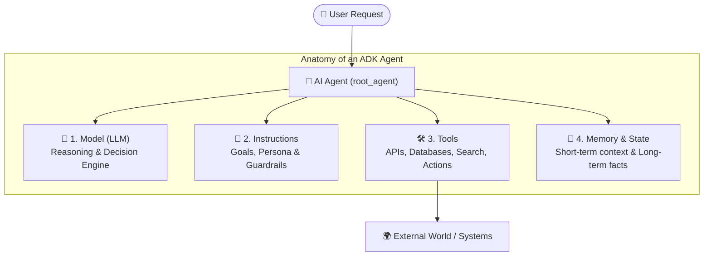
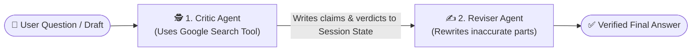

# 📘 Lesson 1: Google ADK Fundamentals — From LLM to AI Agent

This guide covers the foundational mental model of AI Agents and how **Google's Agent Development Kit (ADK)** turns LLMs into modular, software-engineered systems.

---

## 1. What is an AI Agent? (LLM vs. Agent)

### The LLM: A "Brain in a Jar"
A standalone Large Language Model (like Gemini or GPT) is like a brilliant professor locked inside a soundproof room with no internet, no phone, and no notepad:
* It can reason, write, and translate based on what it already knows.
* However, it has **no access to live private data** and **no hands to take action** in external systems.

### The Agent: Giving the Brain a Body, Memory, and a Team
An **AI Agent** wraps that LLM brain with four essential pillars:

1. **🧠 The Brain (`model`)**: The LLM (e.g., `gemini-2.5-flash` or `gemini-2.5-pro`) that interprets user intent and decides which tool or sub-agent to invoke.
2. **📜 Instructions (`instruction` & `description`)**: The agent's job description, persona, workflow steps, and behavioral boundaries.
3. **🛠️ Tools (`tools`)**: Python functions, APIs, databases, Google Search, or MCP servers that allow the agent to fetch live information or perform actions.
4. **💾 Memory & State (`Session State` & `Memory`)**: Short-term state within the current conversation (`session.state`) and long-term cross-session recall.

---

## 2. Core Agent Types in Google ADK

Every ADK application defines an entry point called **`root_agent`** inside `agent.py`. ADK provides four main agent building blocks:

| Agent Class | How It Works | Real-World Analogy | Best Use Case |
| :--- | :--- | :--- | :--- |
| **`LlmAgent`** (or `Agent`) | Powered by an LLM. Dynamically reasons, calls tools, and routes tasks to sub-agents. | **A Manager or Specialist** who thinks on their feet. | Conversational assistants, dynamic routing, tool-using analysts. |
| **`SequentialAgent`** | Executes a fixed list of sub-agents in strict order (`Step 1 -> Step 2 -> Step 3`). | **A Factory Assembly Line**. | Deterministic pipelines (e.g., *Draft -> Fact-Check -> Format*). |
| **`ParallelAgent`** | Runs multiple sub-agents concurrently at the exact same time. | **A Research Committee** working in parallel. | Fetching data from multiple independent sources simultaneously. |
| **`LoopAgent`** | Repeats a sub-agent (or sequence) until an exit condition is met or max iterations are reached. | **An Author & Editor** revising drafts until approved. | Iterative refinement, code generation + automated testing loops. |

---

## 3. How Multi-Agent Teams Collaborate in ADK

### Pattern A: Dynamic LLM Routing (`sub_agents`)
You attach a list of `sub_agents` to a parent `LlmAgent`. Each sub-agent has a clear `name` and `description`. The parent LLM reads the user's request, compares it against the descriptions of its sub-agents, and dynamically transfers control to the right specialist.

### Pattern B: Shared Whiteboard (`Session State` & `output_key`)
Agents in a workflow share a dictionary called **`session.state`** (the "Shared Whiteboard"):
* If Agent 1 is configured with `output_key="research_findings"`, ADK automatically saves Agent 1's final response into `session.state["research_findings"]`.
* Agent 2 can immediately reference `{research_findings}` in its instructions to build upon Agent 1's work.

---

## 4. How `google/adk-samples` is Organized

The official [`google/adk-samples`](https://github.com/google/adk-samples) repository is divided into:
* **`core/`**: Focused canonical recipes teaching a single mechanism well (e.g., `oauth-user-consent-flow`, `cross-session-memory`, `rag-vector-search`, `safety-plugins`).
* **`contrib/` & `python/agents/`**: Complete industry vertical systems (e.g., `data-science`, `llm-auditor`, `financial-advisor`, `customer-service`, `deep-search`).

---

## 5. Built-in ADK Developer CLI Tools

* **`adk web`**: Launches a local browser playground (`http://127.0.0.1:8000`) where you can chat with your agent, inspect every tool call and JSON payload, view the execution graph, and live-edit `Session State`.
* **`adk run`**: Interactive terminal CLI chat with your agent.
* **`adk eval`**: Automated evaluation framework to test agent responses and tool trajectories against golden datasets.
* **`adk deploy`**: One-command deployment to **Google Cloud Run** (`adk deploy cloud_run`) or **Vertex AI Agent Engine** (`adk deploy agent_engine`).
