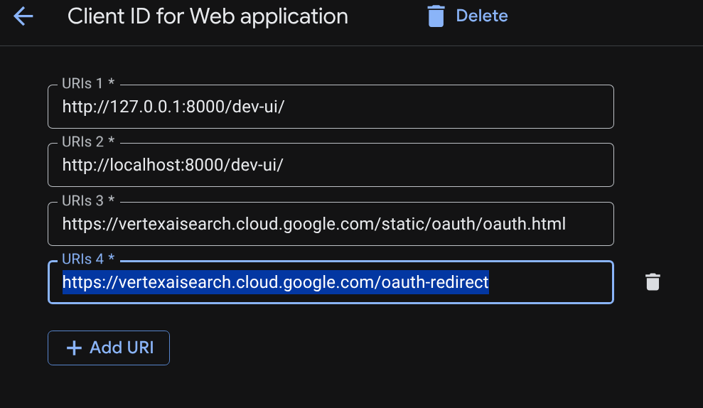

# 🔐 Lesson 3: Authentication, Dual Identity & Production Setup

This guide explains how authentication works in Google ADK—from local development with multiple Google accounts to full enterprise production deployment on **Google Cloud Run** and **Vertex AI Agent Engine**.

---

## 1. Ways to Authenticate Gemini in Google ADK

You configure how ADK connects to Gemini inside [`enterprise_data_agent/.env`](../enterprise_data_agent/.env.example):

| Method | `.env` Configuration | Terminal Setup | When to Use |
| :--- | :--- | :--- | :--- |
| **Way 1: Google AI Studio API Key** | `GOOGLE_GENAI_USE_VERTEXAI=FALSE`<br>`GOOGLE_API_KEY=AIza...` | None | Quick personal prototypes without a GCP project. |
| **Way 2A: Vertex AI + Local ADC** | `GOOGLE_GENAI_USE_VERTEXAI=TRUE`<br>`GOOGLE_CLOUD_PROJECT=your-project` | `gcloud auth application-default login` | Local development against a Google Cloud project. |
| **Way 2B: Service Account Key** | `GOOGLE_APPLICATION_CREDENTIALS=key.json` | None *(Avoid in prod if possible)* | Legacy servers outside Google Cloud. |
| **Way 2C: Attached Cloud Identity (Gold Standard)** | `GOOGLE_GENAI_USE_VERTEXAI=TRUE`<br>`GOOGLE_CLOUD_PROJECT=your-project` | **Zero keys / Zero commands!** | **Production deployment** on Cloud Run or Vertex AI Agent Engine. |

---

## 2. How "Same Code, Two Environments" Works (Option 2A ➔ Option 2C)

One of the best features of Google Cloud's **Application Default Credentials (ADC)** is that **your code and `.env` file do not change between your laptop and production**:

```text
  ╭────────────────────────────────────────────────────────────────────╮
  │ 💻 STAGE 1: ON YOUR LAPTOP (Local `adk web` Development)           │
  │   • ADK checks if it is running on Google Cloud.                   │
  │   • Detects local Linux workstation.                               │
  │   • Automatically reads `~/.config/gcloud/application_default_...` │
  │     created by `gcloud auth application-default login`.            │
  ╰─────────────────────────────────┬──────────────────────────────────╯
                                    │
                  Deploy via `adk deploy cloud_run`
                                    │
                                    ▼
  ╭────────────────────────────────────────────────────────────────────╮
  │ ☁️ STAGE 2: IN PRODUCTION (Cloud Run / Vertex AI Agent Engine)     │
  │   • ADK detects the Google Cloud Metadata Server.                  │
  │   • Automatically uses the container's **Attached Service Account**│
  │     (with `roles/aiplatform.user`) to call Vertex AI Gemini.       │
  │   • 🔒 Zero API keys or `.json` files stored anywhere!             │
  ╰────────────────────────────────────────────────────────────────────╯
```

---

## 3. Using a Different GCP Email for ADK Without Breaking Your Work CLI

If your workstation's default `gcloud` CLI is signed into your corporate email (e.g., `user@company.com`), but your Vertex AI sandbox project belongs to a different email account:

1. **Authenticate ADC with your secondary email** (use `--no-launch-browser` on remote workstations to copy-paste the auth URL into any browser profile):
   ```bash
   gcloud auth application-default login --no-launch-browser
   ```
2. **Set your Quota Project ID on ADC**:
   ```bash
   gcloud auth application-default set-quota-project YOUR_PROJECT_ID
   ```
3. **Update `enterprise_data_agent/.env`**:
   ```env
   GOOGLE_GENAI_USE_VERTEXAI=TRUE
   GOOGLE_CLOUD_PROJECT=YOUR_PROJECT_ID
   GOOGLE_CLOUD_LOCATION=us-central1
   ```
4. **Why this stays separate**: Python and ADK *only* read `application_default_credentials.json`, so your standard terminal `gcloud` CLI can stay signed into your primary work account without conflict!

---

## 4. Production Architecture: The "Dual-Identity" Pattern

In a real enterprise deployment (like **Gemini Enterprise**), your system manages **two distinct identities**:

1. **Server Identity (Attached Cloud Service Account)**:
   * **Who**: `enterprise-agent-sa@your-project.iam.gserviceaccount.com`
   * **Purpose**: Authenticates and pays for calls to the **Vertex AI Gemini LLM brain**.
2. **End-User Identity (Human Employee Sign-In)**:
   * **Who**: `craig.cohen@company.com` or `yan.xuan@company.com`
   * **Purpose**: Passed into `session.state` / `ToolContext` to enforce **Google Drive file permissions** and **database row-level security**.

---

## 5. Local Mock Mode vs. Real Google Drive / BigQuery Production Mode

### Why `USER_PERMISSIONS` Exists in `agent.py` Today
Because `mock_data_dtdb_v2.csv` is a local CSV file on disk, it does not have a built-in Google Drive permissions server. We use the `USER_PERMISSIONS` dictionary in [`enterprise_data_agent/agent.py`](../enterprise_data_agent/agent.py) to **simulate** Drive-level file access (`allowed_files`) and row-level security (`row_filter`) locally.

### What Replaces `USER_PERMISSIONS` in Production?
In production (see **[`google_drive_oauth_agent/agent.py`](../google_drive_oauth_agent/agent.py)**), **you delete `USER_PERMISSIONS` completely**:
1. **For Google Drive Files (`core/python/oauth-user-consent-flow`)**:
   * The user signs in via Google OAuth 2.0.
   * Your `list_drive_files` tool passes the user's OAuth token to the **Google Drive API** (`drive.files().list()`).
   * Google Drive natively filters and returns *only* the files shared with that user's Google account.
2. **For Enterprise Tables (BigQuery Row-Level Security)**:
   * You define a BigQuery Row Access Policy directly on the table:
     ```sql
     CREATE ROW ACCESS POLICY account_manager_filter
     ON project.dataset.trades
     GRANT TO ('domain:company.com')
     FILTER USING (Account_Manager_Email = SESSION_USER());
     ```
   * When your ADK tool runs a BigQuery query using the signed-in user's credentials, BigQuery automatically enforces row-level security at the storage layer!

---

## 6. How Real Agents Added to Gemini Enterprise Handle OAuth (`temp:<AUTH_ID>` & `negotiate_creds`)

In **`google/adk-samples/core/python/oauth-user-consent-flow`** (implemented in our **[`google_drive_oauth_agent/`](../google_drive_oauth_agent/agent.py)**), one single credential helper (`negotiate_creds(tool_context)`) makes the **exact same Python file** work in both **Production Gemini Enterprise** and **Local `adk web`**:

```text
  ┌─────────────────────────────────┬────────────────────────────────────┐
  │   LOCAL DEV (`adk web`)         │   PRODUCTION (Gemini Enterprise)   │
  ├─────────────────────────────────┼────────────────────────────────────┤
  │ 1. User asks to read Drive file │ 1. User asks to read Drive file    │
  │ 2. Stage 3: `request_credential`│ 2. Gemini Enterprise checks linked │
  │    pops up "Sign in with Google"│    `authorizationConfig` (`AUTH_ID`│
  │    button in `adk web` UI       │    = `"google-drive-auth"`)        │
  │ 3. User approves `drive.readonly`│ 3. Gemini Enterprise injects live  │
  │ 4. Stage 2: `get_auth_response` │    OAuth token directly into:      │
  │    caches token in `state`      │    `state["temp:google-drive-auth"]`│
  │ 5. Stage 1 used on next turn    │ 4. Stage 1 finds token immediately!│
  └─────────────────────────────────┴────────────────────────────────────┘
```

### The 3 Stages of `negotiate_creds(tool_context)`:
1. **Stage 1 (Production Gemini Enterprise & Cached State)**:
   * Checks `tool_context.state.get("temp:google-drive-auth")` (where Gemini Enterprise automatically injects the employee's live Google OAuth Access Token) or `tool_context.state.get("google-drive-auth")`.
2. **Stage 2 (Local `adk web` OAuth Callback)**:
   * Checks `tool_context.get_auth_response(auth_config)` after a user clicks the consent screen in `adk web`, and caches the resulting token in `tool_context.state`.
3. **Stage 3 (Local `adk web` Consent Trigger)**:
   * Calls `tool_context.request_credential(auth_config)` to render the interactive **"Sign in with Google"** button inside the `adk web` chat.

---

## 7. GCP OAuth 2.0 Web Client Setup & Redirect URI Checklist

When configuring your OAuth 2.0 Client ID (**Web application**) in Google Cloud Console (`APIs & Services -> Credentials`):

1. **Authorized Redirect URIs (All 4 Local + Production URIs)**:
   Register all **4 exact redirect URIs** on the same Web OAuth Client ID so one credential seamlessly supports both local `adk web` (`127.0.0.1` and `localhost` with trailing `/`) and production Gemini Enterprise (`vertexaisearch.cloud.google.com`):
   * **URIs 1 \***: `http://127.0.0.1:8000/dev-ui/`
   * **URIs 2 \***: `http://localhost:8000/dev-ui/`
   * **URIs 3 \***: `https://vertexaisearch.cloud.google.com/static/oauth/oauth.html`
   * **URIs 4 \***: `https://vertexaisearch.cloud.google.com/oauth-redirect`

   

2. **Pre-load `.env` in `auths.py`**:
   Because `auths.py` reads `os.environ.get("OAUTH_CLIENT_ID")` and `os.environ.get("OAUTH_CLIENT_SECRET")` at module import time when building `AUTH_CREDENTIAL`, call `load_dotenv(Path(__file__).resolve().parent / ".env")` at the top of `auths.py`.


